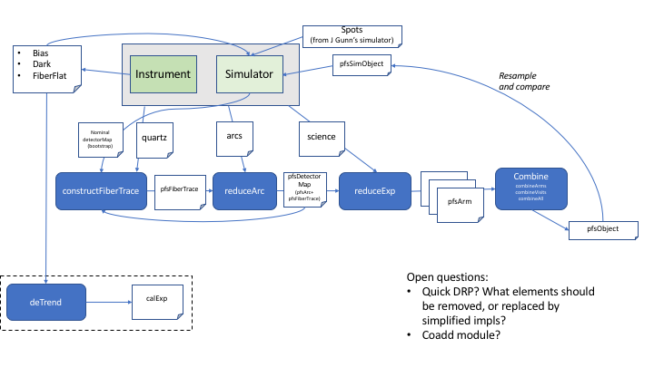

###########
2D DRP Plan
###########

Doc Code: PFS-DRP-PRU030002-01

Introduction
============

Aim
---

This document describes the current working plan for DRP development, 
covering the period from October 2018 until the end of operations.

Data flow
---------

The data flow for 2D DRP processing is depicted in the figure above. Blue boxes indicate main processing units, and white boxes key input data types.
The instrument and its corresponding simulator are shown in central green boxes. The outputs of the simulator and instrument are in general the same (as expected if the simulator simulates the instrument correctly), with the exception that the instrument will provide bias, darks and flats that can be later used by the simulator.

Notes
-----

* Each 2D-DRP release is named according to an incremental version number of the form ``<major>.<minor>`` . For historical reasons, the initial version described in this plan is 4.0 .

Comments and Open Points
------------------------
* Most of work described here will be done by developers at Princeton University. The 1D sky subtraction is expected to be done by NAOJ (Sogo Mineo)
* Sky subtraction: target metric is mentioned in Tamura et al (2016) as '0.5% of the faint sky continuum between the lines'. This needs to be defined even more precisely so that sky subtraction solution can be developed and tested adequately.

2DDRP-4.0 (Sep 2018)
====================

This is the initial release of the pipeline. Used for SM1 r-channel testing at LAM.

- Basic functionality
- Low-level test harness

2DDRP-5.0 (Dec 2018)
====================

This is an intermediate release for K Yabe for 1D sky subtraction study, survey simulation etc. The SIM2D/2D DRP output will be checked against the ETC output prior to release (`SIM2D-88 <https://pfspipe.ipmu.jp/jira/browse/SIM2D-88>`_). For SIM2D and 2D DRP, all outputs will be defined in data model, and generated by these systems. If necessary, mock outputs are generated where no meaningful data can be produced.

- Packaged SIM2D (with all outputs defined in data model and generated)
- Packaged 2D DRP (with all outputs defined in data model and generated)
- SIM2D/2D DRP output checked against ETC.
- Example LSF for 1-D sky subtraction analysis
- Bug fixes
- agreed file formats and directory locations (or through DB)

2DDRP-6.0 (Mar 2019)
====================

Initial end-to-end demonstration of pipeline. Integration test incorporates the 2D simulator,
that provides test quartz, arcs and science data. Quick processing of exposures within 15 minutes is required (J Gunn priv comm 2018). If this is not possible using the full DRP pipeline, a special mode of the pipeline that makes use of more approximate models (eg utilising a more approximate PSF model) will be introduced to achieve this goal.  

- all 3 arms (R, B, N) processed (and possibly M) 
- 3 arms merged
- co-adding
- initial flat-fielding in accordance to new framework
- detector map generated
- initial flux calibration (TBC)
- more complete test harness
- Initial 2D PSF model with color dependence
- initial 'Quick' DRP mode available and demonstratable

2DDRP-7.0 (July 2019)
====================

Version for early PSF commissioning. Sky data from LAM used for PSF model color dependence. 'Quick' DRP as well as the 'full' DRP should be available. Quick DRP should function at LAM as well as at the summit, in coordination with the ICS. 2D sky subtraction using arcs (TBC). Robust and simple 1D sky subtraction.

- Initial telluric absorption
- Initial 2D sky subtraction (to 2% [TBC] of the faint sky continuum between the lines)
- Initial 1D sky subtraction (to 2% [TBC])
- Quick DRP available 

2DDRP-8.0 (Mar 2020)
====================

Updated version for commissioning. Raster scan observations will take place at this time to refine the accuracy of fiber positioning. For this, Quick DRP will output numeric data of wavelength-calibrated, flux-calibrated one-dimensionalized spectra. with improvements based on acquired data during the early commissioning phase. Updates to the pipeline will be made based on acquired data (particularly dark time), from SM1 and SM2 modules initially.

- Updated 2D PSF model
- Improved telluric absorption
- Updated 2D sky subtraction (to 1% of the faint sky continuum between the lines [TBC])
- Performance (speed) improved 
- Updated Quick DRP for wavelength-calibrated spectra

2DDRP-9.0 (Sep 2020)
====================

Intermediate release with functional updates. Updates to the pipeline will be made based on acquired data from SM3, as well as the SM1 and SM2 modules.

2DDRP-10.0 (Jan 2021)
====================

Further improvements. Pipeline incorporates acquired data from all 4 SM modules.

- Bug fixes
- Missing functions
- Refactoring
- Performance (speed) improvements
- sky subtraction to 0.5% of the faint sky continuum between the lines

